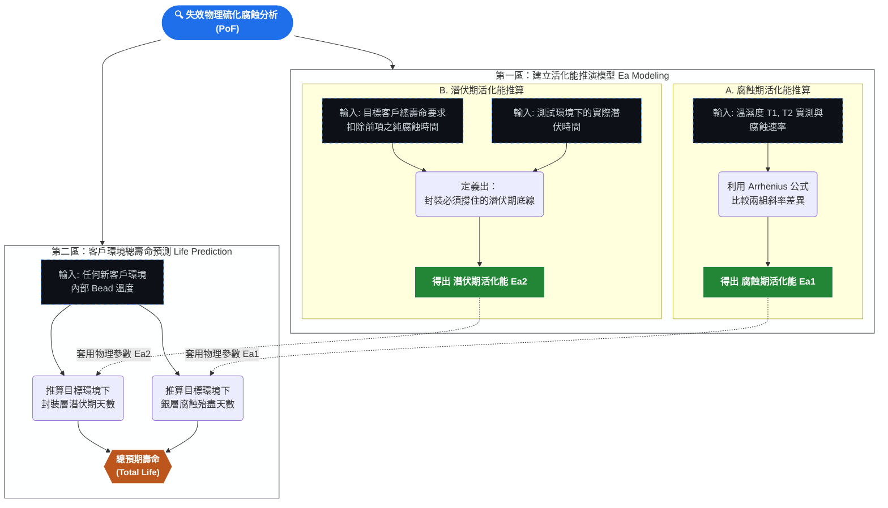

# 失效物理硫化腐蝕計算工具 (PoF Sulfur Corrosion Calculator)

這是一個基於失效物理 (Physics of Failure, PoF) 原理所建立的單機版硫化腐蝕可靠度計算網頁工具。
將整體失效機制精準切分為**潛伏期 (Incubation Phase)** 與**腐蝕反應期 (Corrosion Phase)**，並各自應用 Arrhenius (阿瑞尼士) 模型進行溫度加速壽命推估。

## 雙區塊功能
### 1. 建立活化能推演模型 (Ea Modeling)
- 依據兩組不同溫度的實測腐蝕速率推算「腐蝕期活化能 $E_{a1}$」。
- 依據客戶總壽命要求減去第一階段計算出的所需腐蝕時間，反推並精算對應防護層阻擋氣體進入所需的「潛伏期活化能 $E_{a2}$」。

### 2. 客戶環境總壽命預測 (Life Prediction)
- 基於上述推演完成的一組 $E_{a1}, E_{a2}$ 參數。
- 只需輸入任何客戶環境之內部 Bead 溫度 (°C)。
- 系統將立刻推算出在目標環境下的：
  - 封裝層可撐住的潛伏期天數
  - 內部被徹底硫化腐蝕反應殆盡之天數
  - 合併後的「總可靠度壽命 (Total Predicted Life)」，支援天數、月數與年數。

## 開發技術
以純前端 (Vanilla HTML, JS, CSS) 應用程式撰寫，輕量級且具高資安保密性（無需連上外部伺服器），支援暗色模式 (Dark Mode) 以及現代化多視窗彈性介面設計。

## 分析流程圖

